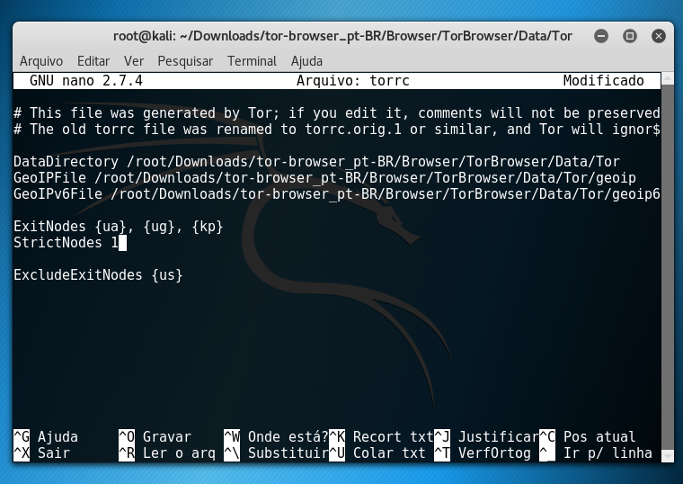
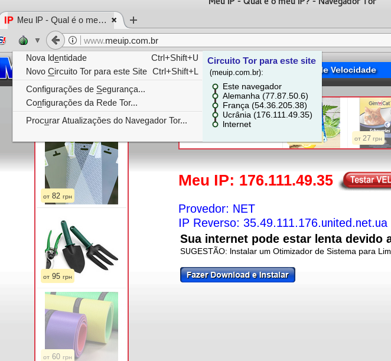
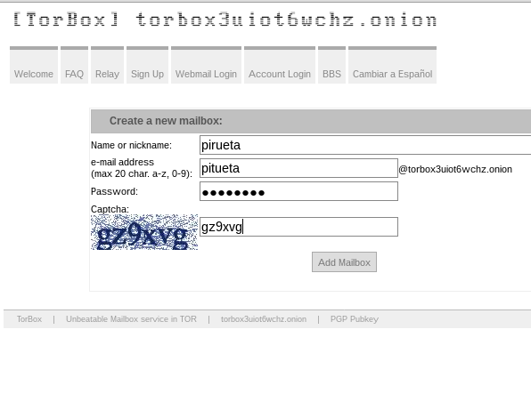
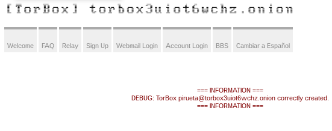
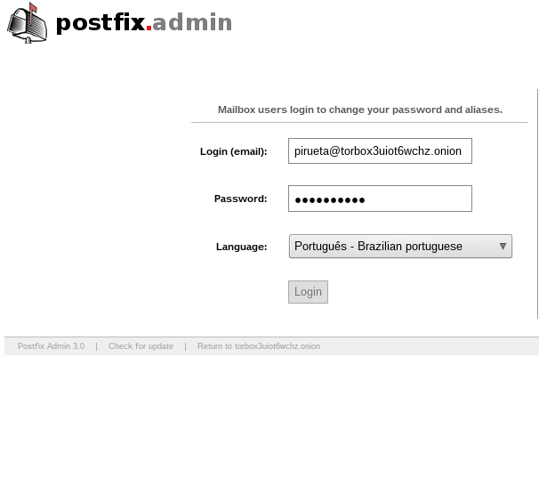
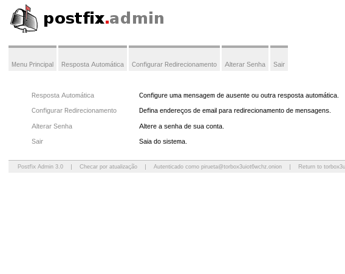

## Protocolo Tor <br>

Tor (anteriormente um acrônimo para The Onion Router) é um software livre e de código aberto que proporciona o anonimato pessoal ao navegar na Internet e em atividades online, protegendo contra a censura e principalmente a privacidade pessoal. A maioria das distribuições GNU/Linux disponibilizam o Tor, embora haja versões para diferentes sistemas operacionais, tais como Windows e Mac OS. A rede Tor é uma rede de túneis http (com tls) sobrejacente à Internet, onde os roteadores da rede são computadores de usuários comuns rodando um programa e com acesso web (apenas). O objetivo principal do projeto é garantir o anonimato, e consequentemente privacidade, ao usuário que está acessando a web. <br>[ver mais](https://pt.wikipedia.org/wiki/Tor_(rede_de_anonimato))

##Dupla

[Jefté de Sousa](https://github.com/bassebete/information-security)
[Róger F. Lima](https://github.com/Roger-F-Lima/Seguranca-Da-Informacao)<br>

## Como vocês dividiram/fizeram a atividade?

Nós nos reunimos para discutir para o que deveriamos falar, então chagamos a comclusão que falariamos uma pouco sobre VPN (Virtual Private
Network), criptografia, tunelamento, relays, como e porque é importante ficar anônimo.

## O que você aprendeu e o que ainda tem dificuldade?

Nós aprendemos sobre como funciona a rede Tor, semelhanças entre ele e outros protocolos como o Torrent, nossa grande dificuldade foi a
configuração de Relays, pois a mesma se mostrou bastante bugada.

## Quanto tempo você gastou no total na atividade?

Cerca de quatro horas, decidindo o que iramos falar e reunido tutorias.

## Tutorial de como selecinar o pais pelo qual seu tráfico vai passar.

# Prática Tor

## Instalando o Tor

Baixando
```
curl -O -L https://www.torproject.org/dist/torbrowser//7.5.4/tor-browser-linux64-7.5.4_pt-BR.tar.xz
```
Descompactando
```
tar xvf tor-browser-linux64-7.5.4_pt-BR.tar.xz
```
Acessando o dirétorio gerado
```
cd tor-browser_pt-BR
```
Modificando alguns parametros para o funcionamento do Tor
```
sed -i 's/"`id -u`" -eq 0/"`id -u`" -eq x/' Browser/start-tor-browser
```
```
sed -i 's/The Tor Browser Bundle should not be run as root.  Exiting.//' Browser/start-tor-browser
```
## Configurando uma lista negra



## Acessando um site que rastreia o IP
Navegador que implementa o protocolo Tor (podemos observar a rota que a solicitação fez)

Abrindo o navegador Tor
```
./Browser/start-tor-browser 2> /dev/null &
```



Navegador que não implementa 


## Acessando um site na Deep Web
Criei um email na rede onion. Segue o site: `http://torbox3uiot6wchz.onion/`

As imagens abaixo apresenta os passos: `Criar o email`, `confirmação do precedimento de criação`, `tela de acesso` e `acessando o email`, respectivamente.









Tutorial por Jardel Goncalves.

## VPN e Tunelamento 
Uma Rede Particular Virtual (Virtual Private Network – VPN), como o próprio nome sugere, é uma forma de conectar dois computadores
utilizando uma rede pública, como a Internet (a rede pública mais utilizada para este propósito).<br>[ver mais]
(https://www.tecmundo.com.br/1427-o-que-e-vpn-.htm)
 
## Ataque de Temporização 
Observar a medida de tempo inclui os ruídos externos (como latência de rede, diferenças de tempo no acesso a disco, etc.). Apesar disso, ataques de temporização são práticos contra diversos algoritmos como: RSA, ElGamal e DSA.

## Linkes uteis
<br>[tecmundo](https://www.tecmundo.com.br/1427-o-que-e-vpn-.htm)
<br>[ufrj](https://www.gta.ufrj.br/ensino/eel879/trabalhos_vf_2010_2/rodolfo/tor.html)
<br>[wikipedia](https://pt.wikipedia.org/wiki/Ataque_de_temporiza%C3%A7%C3%A3o)
<br>[technedigitus](https://www.technedigitus.com/2015/09/configurando-o-tor-para-escolher-quais.html)
<br>[wikihow](https://pt.wikihow.com/Definir-um-Pa%C3%ADs-Espec%C3%ADfico-no-Navegador-de-Internet-Tor)
<br>[b3rn3d](http://www.b3rn3d.com/blog/2014/03/05/tor-country-codes/)
<br>[scottlinux](https://scottlinux.com/2013/04/07/how-to-run-a-tor-relay-on-ubuntu-or-debian/)
<br>[Tor Project](https://www.torproject.org/)
## Questões

## 1ª) Instalar o Tor no linux ou windows.
## 2ª) Configurar uma lista negra de paises pelos quais não ache seguro passar.
## 3ª) Acessar alguns sites que rastreiam seu ip para testar o anônimato do Tor.
## 4ª) Acessar algum site da deep web e tirar uns prints da tela do site.
